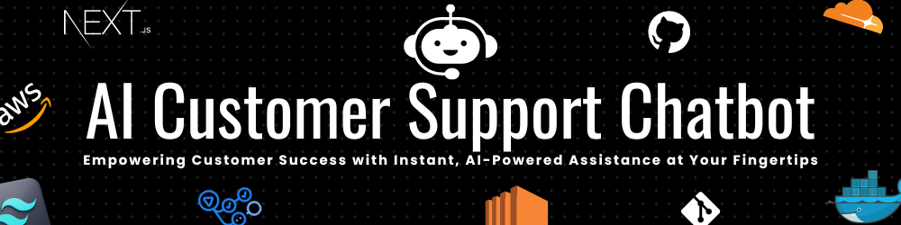

## Project Overview
The project aims to develop an AI-powered customer support system for educational purpose that can provide personalized and efficient support to customers. It uses the `Cloudflare` REST API key to generate the response.

## ⚙️ Features

❖ **Basic Chatbot**: Hard-coded responses for straightforward interactions.

❖ **Intelligent Responses**: Leveraging Gen-AI models for dynamic user engagement.

❖ **Deployment**: Hosted on AWS EC2 for reliable and scalable access.

<!-- ❖ **RAG Implementation**: Contextual responses based on a knowledge base. -->

<!-- ❖ **LLM Orchestration**: Routing and task-specific models for complex queries. -->

❖ **Multi-language Support**: Catering to a diverse global customer base.

❖ **User Authentication**: Personalized chat experiences.

<!-- ❖ **Feedback Mechanism**: Users can give the feedback about chatbot responses for continuous improvement. -->


## Project Plan

### Level 1: Basic Chatbot
- **Objective**: Develop a simple chatbot with hard-coded responses.
- **Tasks**:
  - Set up a Next.js project.
  - Create a basic chatbot UI using Tailwind CSS.
  - Implement hard-coded responses.

### Level 2: Intelligent Responses
- **Objective**: Enhance the chatbot to handle user queries using a Gen-AI model.
- **Tasks**:
  - Integrate the Cloudflare API with the chatbot.
  - Implement natural language processing for dynamic responses.
  - Test and refine response accuracy.

### Level 3: Deployment
- **Objective**: Deploy the web app on AWS EC2 servers.
- **Tasks**:
  - Set up an **AWS EC2 instance** with rerver proxy using `NGINX`

<!-- ### Level 4: RAG Implementation
- **Objective**: Implement Retrieval-Augmented Generation (RAG) for enhanced responses.
- **Tasks**:
  - Set up and manage a knowledge base.
  - Implement RAG for contextually relevant responses.
  - Validate and optimize response accuracy. -->

<!-- ### Level 4.5: LLM Orchestration
- **Objective**: Develop an orchestration pattern with routers and task-specific models.
- **Tasks**:
  - Create routing mechanisms for different query types.
  - Integrate task-specific LLM models.
  - Ensure seamless operation and interaction. -->

### Bonus Features
- **Multi-language Support**:
  - Implement language detection and translation features.
  - Test and validate multilingual responses.
- **User Authentication**:
  - Add user authentication for personalized experiences.
  - Ensure secure and user-specific interactions.
- **Feedback Mechanism**:
  - Implement a feedback system for users to rate responses.
  - Analyze feedback for continuous improvement.

## Running the applicaition using **Docker**
- **Step 1**: Download the [docker desktop](https://www.docker.com/products/docker-desktop/) and proceed further.

- **Step 2**: Pull the Docker image using the following command: 
```bash
docker pull surajkumar00/ai-customer-support
```
- **Step 3**: Run the Docker container using the following command: 
```bash
docker run -it -p 3000:3000 surajkumar00/ai-customer-support
```
- **Step 4**: Access the application using the following URL: http://localhost:300


## 👨🏻‍💻 Installation guide on local machine
1. Clone the repository using
```bash
git clone https://github.com/username/ai-customer-support.git
```
2. Install dependencies using

```bash
npm install
npx shadcn-ui@latest init
npm i lucide-react
```

3. Set the Cloudflare REST API Key
- First create `.env.local` file in the root directory. Then add the below code in it.

```bash
CLOUDFLARE_API_KEY=your_api_key
```

4. Start the development server using 
```bash
npm run dev
```

5. Access the chatbot at http://localhost:3000

## [Want to contribute!](/CONTRIBUTING.md)


## 📈 Deployment

❖ **Deployed Application**: 
[Check our Chatbot]()

❖ **Video Explanation**: [Link of the Demo Video]()

## 🏵️ Acknowledgements
- **Special thanks to the open-source community for their valuable resources and tools.**
- **Thanks to our contributors for their dedication and hard work**
